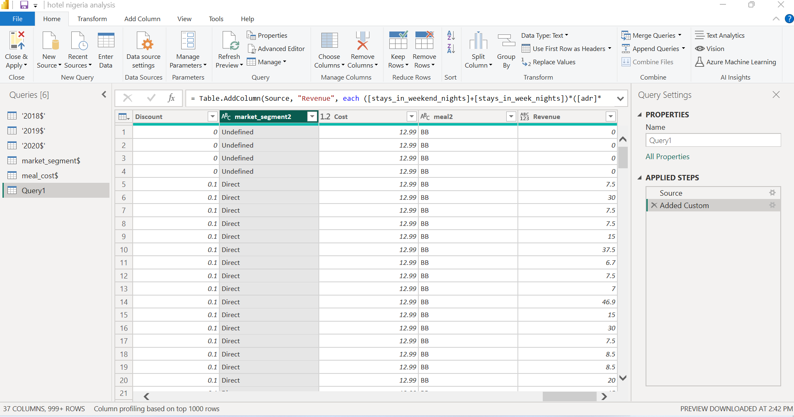
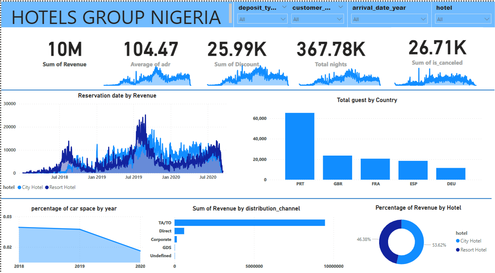

# HOTEL-GROUPS-ANALYSIS

## Introduction 

This is a POWER BI project on revenue analysis of an imaginery hotel called Hotel groups. The project is to analyze and obtain insight to tackle important questions and hep the hotel make data driven decisions. 
** DISCLAIMER: _The datasets and reports do not represent any company but a dummy datasets_

## Problem Statement

- Is the hotel revenue growing by year; the hotel is classified into two types which are City and Resort.
- Should the parking size be increased; we want to know the trend with personal cars
- What type of distribution channel affect the revenue?
- Country with the highest revenue.

## Skills Demonstrated 

The following POWER BI features were incorporated; 
- New measures
- Page navigation
- New column
- Filters and visualization
  Ms SQL server skills that were incorparated;
  - union statement was used to combine all three tables together
  - with statement to give a temporary table called 'hotels' 

The queries above was imported into the POWER BI and a new column was created for using the stays_in_weeks_night + stays_in_weekend_night * adr * discount.

The datasets initially consisted of 5 tables which was merged with an sql query above which made it a total of 37 columns and over 100,000 rows

## Visualization

The report comprises of the Hotel 
- total revenue for three years (2018, 2019,2020)
- total guest by country
- percentage of car space by year
- reservation date by revenue

 The report can be accessed here --- 

 ## Analysis

 ### Revenue analysis
 The revenue was covered for two hotels Resort and City and for the year 2018,2019, and 2020. it was calculated from the adr and discount as said above. 

 ### Total night
 this is gotten from the addition of stays_in_weeks and stays_in_weekends using the new measures on power BI 

### Percentage by car space
This analysis was made to check how the customers make use of the car space from space by division of total nights by required car space.

### Reservation date by date 

The date were filtered to start from 1/1/2018 t0 1/1/2020 and was visualized with a clustered area chart to check how revenue were made by date of reservation.

## Conclusion and Recommendation

- Portugal is the country with the highest revenue by country
- The car space percentage reduced in 2020
- The revenue increased by year to a certain level
- 2019 has the highest revenue and must be taken into consideration so we can continue with high revenue
